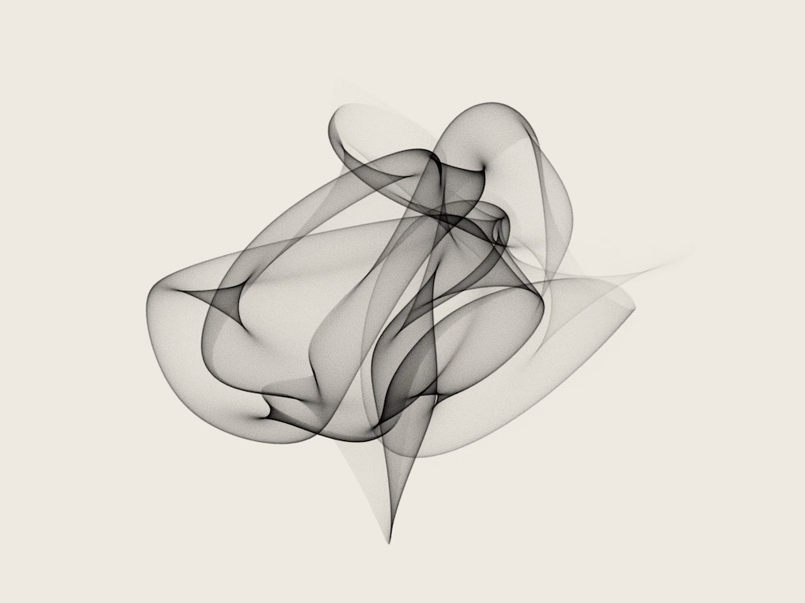

Sketches
========

Some creative / generative coding sketches.  I'm trying to learn Rust (and [Nannou](https://github.com/nannou-org/nannou)) at the same time so the code will probably be very messy!

| Sketch                                                    | Description / preview                   |
| :-----                                                    | --------------------:                   |
| [AEye](https://github.com/smutch/sketches/tree/main/aeye) |  |
| [Sand spline](https://github.com/smutch/sketches/tree/main/sand_spline) |  |

